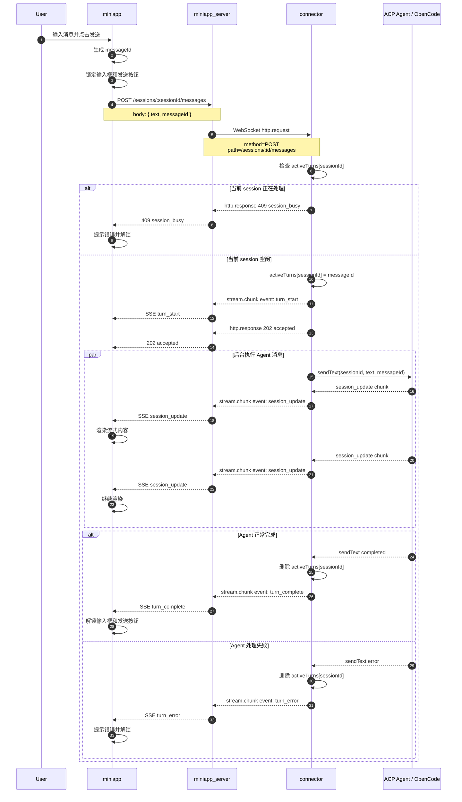

# remote_acp 技术评审说明

## 1. 背景和目标

当前项目要解决的问题是：浏览器或 miniapp 这类前端客户端，不能直接访问用户本机运行的 connector，也不应该直接暴露本机 Agent 端口。

因此项目引入 `miniapp_server` 作为中间层。connector 启动后主动连接 `miniapp_server`，前端只和 `miniapp_server` 通讯。

整体目标：

- 前端可以远程控制用户本机或远端的 ACP Agent。
- connector 不需要暴露本地 HTTP/WebSocket 端口。
- server 可以重启，connector 和前端都能重连。
- 支持多用户，每个用户本地运行自己的 connector。
- 支持流式响应、断线续传、同一 session 串行发送消息。

## 2. 总体架构

```text
miniapp
  |
  | HTTP + SSE
  v
miniapp_server
  |
  | WebSocket
  v
connector
  |
  | ACP stdio / ACP WebSocket
  v
OpenCode / 其他 ACP Agent
```

## 3. 三端职责

### miniapp

`miniapp` 是前端界面，负责：

- 展示 Agent、项目、Session、聊天内容。
- 发送用户消息。
- 接收 Agent 的流式响应。
- 渲染工具调用、权限请求、elicitation 表单。
- 维护当前 session 的发送锁：上一条消息没有处理完，不能继续发送下一条。
- 维护当前 session 的 SSE 续传位置。

### miniapp_server

`miniapp_server` 是薄中转层，负责：

- 对 miniapp 暴露 HTTP API。
- 对 miniapp 暴露 SSE `/events`。
- 对 connector 暴露 WebSocket `/connector`。
- 根据 `userId` 找到对应 connector。
- 把前端 HTTP/SSE 请求转发给 connector。

它不直接处理 ACP 业务逻辑，也不持久化 Agent 状态。

### connector

`connector` 是真正和 Agent 通讯的一端，负责：

- 启动或连接 ACP Agent。
- 处理 `/projects`、`/sessions`、`/messages` 等业务接口。
- 把 ACP session update 转成 SSE 事件。
- 维护 `eventBuffer`，支持断线续传。
- 维护 `activeTurns`，保证同一个 session 同一时间只有一条消息在处理。

## 4. 为什么 connector 主动连接 server

connector 通常运行在用户本机，可能处于 NAT、防火墙、内网环境里。让 server 主动访问 connector 不可靠，也会带来本机端口暴露问题。

所以采用：

```text
connector -> miniapp_server
```

connector 启动后主动建立 WebSocket 连接：

```text
ws://miniapp_server/connector?userId=xxx
```

这样有几个好处：

- 不需要暴露用户本机端口。
- server 重启后，connector 可以自动重连。
- 多用户场景下，每个用户本机 connector 都连到同一个 server。
- server 只需要按 `userId` 路由请求。

## 5. 通讯方式

### miniapp 到 miniapp_server

前端到 server 分成两类：

```text
普通操作：HTTP
流式响应：SSE / EventSource
```

发送消息：

```text
POST /sessions/:sessionId/messages?userId=xxx
```

接收流式事件：

```text
GET /events?sessionId=xxx&userId=xxx
```

### miniapp_server 到 connector

server 和 connector 之间使用一条 WebSocket 长连接。

server 把 HTTP 请求包装成 WebSocket 消息：

```json
{
  "type": "http.request",
  "requestId": "...",
  "method": "POST",
  "path": "/sessions/xxx/messages?userId=xxx",
  "headers": {},
  "body": "{\"text\":\"...\"}"
}
```

connector 返回：

```json
{
  "type": "http.response",
  "requestId": "...",
  "status": 202,
  "headers": {},
  "body": "{\"ok\":true}"
}
```

SSE 事件通过 WebSocket chunk 转发：

```json
{
  "type": "stream.chunk",
  "streamId": "...",
  "chunk": "id: 12\nevent: session_update\ndata: {...}\n\n"
}
```

## 6. 发送消息流程

发送消息被拆成两层语义：

- HTTP 返回：消息是否成功提交。
- SSE 返回：消息处理过程和最终结果。

具体流程：

1. 用户在 miniapp 输入消息并点击发送。
2. miniapp 生成 `messageId`。
3. miniapp 锁定输入框和发送按钮。
4. miniapp 调用 `POST /sessions/:sessionId/messages`。
5. miniapp_server 把请求转发给 connector。
6. connector 检查 `activeTurns[sessionId]`。
7. 如果 session 正在处理，返回 `409 session_busy`。
8. 如果 session 空闲，记录 `activeTurns[sessionId] = messageId`。
9. connector 发送 `turn_start` SSE 事件。
10. connector 立即返回 `202 accepted`。
11. connector 后台调用 ACP `sendText(...)`。
12. Agent 的流式输出通过 `session_update` SSE 回到 miniapp。
13. `sendText(...)` 正常完成后，connector 发送 `turn_complete`。
14. `sendText(...)` 失败时，connector 发送 `turn_error`。
15. miniapp 收到 `turn_complete` 或 `turn_error` 后解锁输入框和发送按钮。

## 7. 发送消息时序图



## 8. 为什么使用 SSE

miniapp 到 server 的实时方向主要是单向的：

```text
miniapp -> server：提交命令
server -> miniapp：持续推送事件
```

所以这里使用：

```text
HTTP 负责提交命令
SSE 负责接收流式结果
```

SSE 的优势：

- 浏览器原生支持 `EventSource`。
- 适合服务端持续推送。
- 支持事件名，例如 `session_update`、`turn_complete`。
- 支持事件 id，方便断线续传。
- 前端不需要维护复杂的 WebSocket RPC 协议。

WebSocket 只用于 `miniapp_server` 和 connector 之间，因为那一段需要 server 主动转发请求给 connector，并接收 connector 的响应和流式 chunk。

## 9. 断线恢复机制

connector 维护内存事件 buffer：

```text
eventBuffer: [
  { id: 1, eventName, payload, sessionId },
  { id: 2, eventName, payload, sessionId }
]
```

每条 SSE 都带有事件 id：

```text
id: 12
event: session_update
data: {...}
```

miniapp 每收到一条 SSE，就记录当前 session 的最后事件 id。

如果前端网络断开，或 `miniapp_server` 重启：

1. miniapp 的 EventSource 触发 `error`。
2. miniapp 主动关闭旧 EventSource。
3. miniapp 1 秒后重建 `/events` 连接。
4. 重连时带上 `afterSeq`：

```text
/events?sessionId=xxx&userId=xxx&afterSeq=12
```

connector 收到后，从 `eventBuffer` 中补发 `id > 12` 的事件。

这样只要 connector 没重启，server 单独重启或前端短暂断网，后续流式响应可以继续接上。

## 10. 多用户模型

当前设计是：

```text
一个 userId 对应一个 connector WebSocket
```

server 内部维护：

```text
connectors[userId] = {
  socket,
  agentInfo,
  pendingResponses,
  pendingStreams
}
```

miniapp 请求带：

```text
?userId=xxx
X-Remote-Acp-User-Id: xxx
```

connector 启动时也带同一个 userId：

```powershell
$env:APP_SERVER_USER_ID="alice"
npm run dev
```

server 根据 `userId` 把请求路由到对应用户的 connector。

## 11. server 重启后的行为

`miniapp_server` 是薄中转层，不持久化核心 Agent 状态。

server 重启后：

1. connector WebSocket 断开。
2. connector 自动重连 `/connector`。
3. miniapp SSE 断开。
4. miniapp 自动重连 `/events`，并带上 `afterSeq`。
5. connector 根据 `eventBuffer` 补发断开期间事件。

关键点是：事件 buffer 放在 connector，而不是 server。

## 12. 当前限制

### connector 重启后无法补齐流式事件

当前 `eventBuffer` 是 connector 内存状态。connector 重启后，buffer 会丢失。

如果要支持 connector 重启后继续补齐，需要把事件持久化到 SQLite 或文件。

### buffer 有窗口限制

当前事件缓存是短期缓存，不是永久历史记录。断开时间过长时，旧事件可能已经被清理。

### 只支持当前 session 的 SSE

项目已经去掉全局审批 SSE。现在只有进入某个 session 后才打开：

```text
/events?sessionId=xxx&userId=xxx
```

### OpenCode ACP listSessions 偶发缓存差异

曾出现过 OpenCode 客户端或 CLI 能看到 session，但 ACP `listSessions({ cwd })` 返回空的情况。重启 OpenCode ACP 后恢复。

这个现象更像 OpenCode ACP 进程内部缓存或 project/session 状态没有刷新，不是 `miniapp_server` 转发问题。

## 13. 设计取舍

当前方案的核心取舍：

```text
server 保持薄
connector 持有 Agent 状态
miniapp 只负责 HTTP 提交和 SSE 观察
```

优点：

- connector 可以运行在用户本机。
- 不需要暴露用户本地端口。
- server 可以重启。
- 支持多用户。
- 前端不用维护 WebSocket RPC。
- 流式响应和断线续传逻辑比较清晰。

代价：

- connector 是关键状态点。
- connector 重启后不能恢复内存事件 buffer。
- 如果未来要强一致恢复，需要持久化 turn/event 状态。

## 14. 后续优化方向

### 持久化事件 buffer

把 `eventBuffer` 持久化到 SQLite 或文件，让 connector 重启后也能补发事件。

### 增加 turn 状态查询接口

例如：

```text
GET /sessions/:sessionId/turns/:messageId
```

用于查询当前 turn 是 `running`、`completed` 还是 `failed`。

### 增加 server 连接状态页

展示：

- `userId`
- connector 是否在线
- `agentInfo`
- `pendingResponses` 数量
- `pendingStreams` 数量

方便排查多用户和断线问题。

## 15. 总结

当前实现是一个薄 server + 本地 connector 的远程 Agent 控制架构。

```text
miniapp 用 HTTP 提交操作
miniapp 用 SSE 接收流式结果
miniapp_server 只负责转发
connector 负责 ACP、session、turn 状态、流式事件和断线续传
```

这套设计优先保证本地 connector 易部署、server 可重启、前端协议简单，并为后续多用户和持久化恢复留出了扩展空间。
